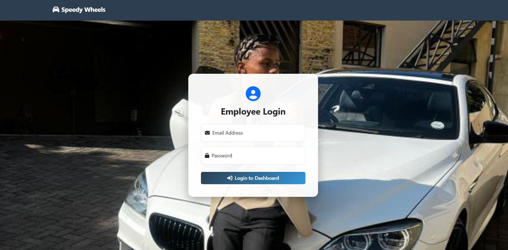
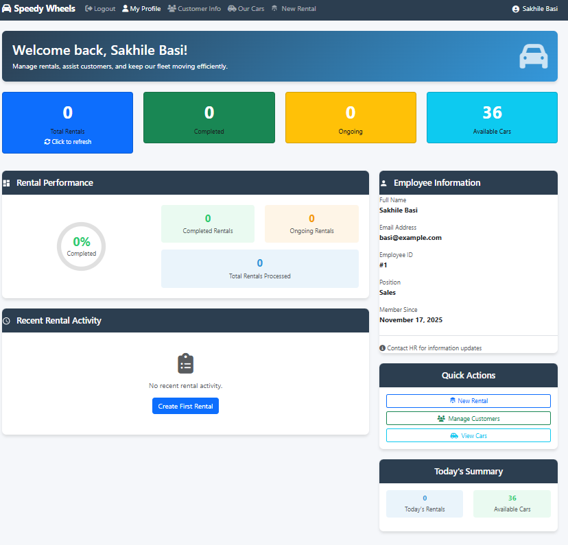
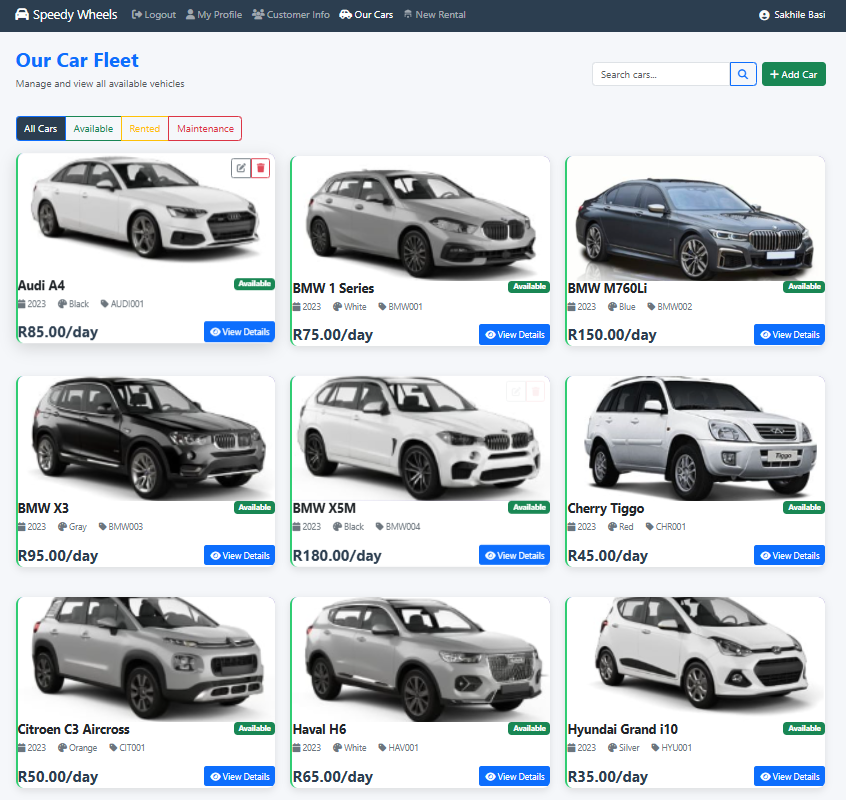
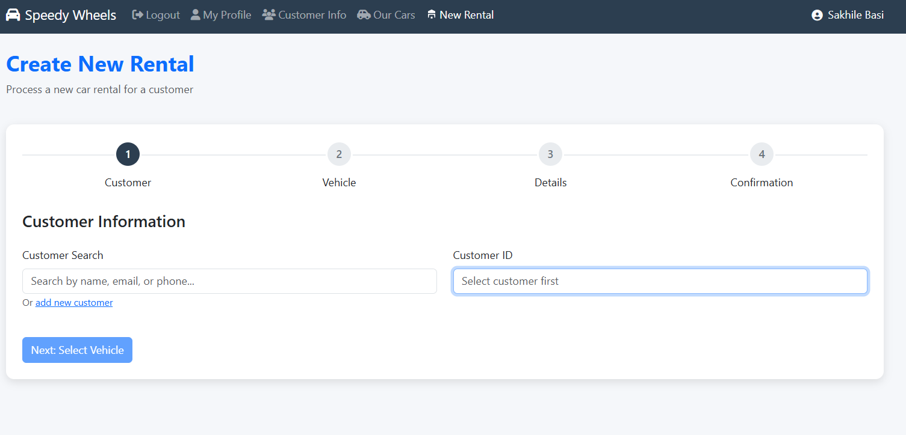

<!-- Improved compatibility of back to top link -->
<a id="readme-top"></a>

<!-- PROJECT SHIELDS -->

[![project_license][license-shield]][LICENSE]
[![LinkedIn][linkedin-shield]][https://www.linkedin.com/in/sakhile-basi-556272255/]


<br />
<div align="center">
  <a href="https://github.com/Sakhile-Basi/Speedywheels">
  </a>

<h3 align="center">SpeedyWheels Car Rental System</h3>

  <p align="center">
    A PHP/MySQL-based system that helps employees manage rentals, customers, and vehicle inventory with ease.
    <br />
    <a href="https://github.com/Sakhile-Basi/Speedywheels"><strong>Explore the docs »</strong></a>
    <br />
    <br />
    <a href="https://github.com/Sakhile-Basi/Speedywheels">View Demo</a>
    &middot;
    <a href="https://github.com/Sakhile-Basi/Speedywheels/issues/new?labels=bug&template=bug-report---.md">Report Bug</a>
    &middot;
    <a href="https://github.com/Sakhile-Basi/Speedywheels/issues/new?labels=enhancement&template=feature-request---.md">Request Feature</a>
  </p>
</div>

<!-- TABLE OF CONTENTS -->
<details>
  <summary>Table of Contents</summary>
  <ol>
    <li><a href="#about-the-project">About The Project</a></li>
    <li><a href="#features">Features</a></li>
    <li>
      <a href="#getting-started">Getting Started</a>
      <ul>
        <li><a href="#prerequisites">Prerequisites</a></li>
        <li><a href="#installation">Installation</a></li>
      </ul>
    </li>
    <li><a href="#screenshots-and-videos">Screenshots and Videos</a></li>
    <li><a href="#tech-stack">Tech Stack</a></li>
    <li><a href="#roadmap">Roadmap</a></li>
    <li><a href="#contributing">Contributing</a></li>
    <li><a href="#license">License</a></li>
    <li><a href="#contact">Contact</a></li>
    <li><a href="#acknowledgments">Acknowledgments</a></li>
  </ol>
</details>

<!-- ABOUT THE PROJECT -->
## About the Project

SpeedyWheels is a full-featured rental management web system designed for car rental businesses.  
It allows employees to manage vehicles, customers, rentals, payments, and more from a clean and accessible dashboard.

<p align="right">(<a href="#readme-top">back to top</a>)</p>

## Features
- Employee login & profile management  
- Car inventory management  
- Customer tracking  
- Rental & purchase tracking  
- Clean dashboard UI  

<p align="right">(<a href="#readme-top">back to top</a>)</p>

<!-- GETTING STARTED -->
## Getting Started

Follow the steps below to get the project running locally.

### Prerequisites
* npm (optional, only for certain tools)
```sh
npm install npm@latest -g
```
### Installation 

1. Clone the Repo
``` sh
git clone https://github.com/Sakhile-Basi/Speedywheels.git
```

2. Copy the sample config file
``` sh 
cp includes/config.sample.php includes/config.php
```

3. Create and import the database
``` sh 
mysql -u root -p car_rental < sql/schema.sql
```

4. Run the project using XAMPP/WAMP

5. Open index.php in your browser

<p align="right">(<a href="#readme-top">back to top</a>)</p>

## Screenshots and Videos
1. Login page:  , <video controls src="screenshotsAndVideos/20251117-2114-23.0422261.mp4" title="Title"></video> 2. Employee dashboard:  3. Customer info:  4. Fleet into:  5. New rental: 

<p align="right">(<a href="#readme-top">back to top</a>)</p>

## Tech Stack
- PHP 8
- MySQL
- Bootstrap 5
- FontAwesome
- HTML/CSS/JS

<p align="right">(<a href="#readme-top">back to top</a>)</p>

## License

See  for details.

## Contact
Sakhile Basi – kopano.basi21@gmail.com

Project Link: https://github.com/Sakhile-Basi/Speedywheels

<p align="right">(<a href="#readme-top">back to top</a>)</p>


